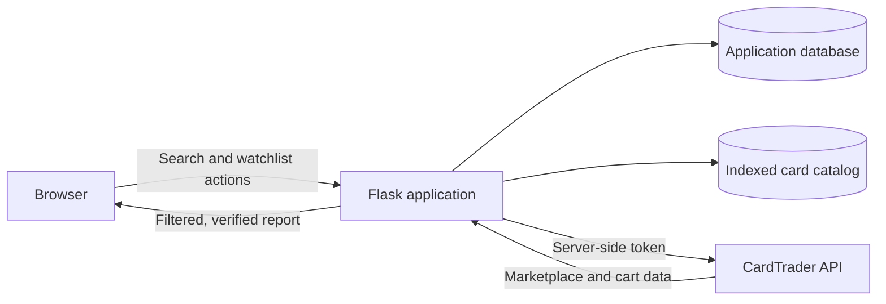

# CardTrader Watchlist

### A production-minded Flask application for finding Magic: The Gathering cards and verifying whether matching CardTrader Zero offers are actually available.

This project turns a repetitive marketplace workflow into a focused web product. Users build watchlists, define acceptable price, language, and condition criteria, and run live availability checks against CardTrader. A passwordless guest mode makes the complete workflow accessible to portfolio reviewers without exposing credentials or requiring account creation.

> **Portfolio demo:** open the deployed application from this repository's **About** section and select **Continue as guest**. The guest account uses a shared watchlist, so reviewers can immediately search, edit criteria, and run a live price check.

## What you can try

1. Continue as a guest—no registration or API key required.
2. Search a catalog of more than 118,000 Magic card blueprints.
3. Add cards to the shared demonstration watchlist.
4. Set a maximum price, accepted languages, and minimum condition.
5. Run a live check to find qualifying CardTrader Zero inventory.

Guest users get the real product workflow, not a mocked interface. They share one communal watchlist and cannot access credentials, account configuration, or watchlist ownership controls.

## Why I built it

Marketplace listings are not always equivalent to immediately purchasable inventory. A useful result must satisfy several constraints at once and still be available when checked.

The application therefore does more than compare prices. It:

- Filters offers by price, language, condition, seller eligibility, and card properties.
- Rejects foil, signed, altered, graded, and misprint variants when they do not match the intended purchase.
- Verifies availability through the CardTrader cart, then removes the temporary cart quantity.
- Handles stale offers without abandoning the rest of a price-check run.
- Sorts the final report around actionable offers and quantities.

## Engineering highlights

| Area | Implementation |
| --- | --- |
| Backend | Flask application factory, SQLAlchemy models, Flask-Login sessions, server-rendered Jinja templates |
| Data | Indexed SQLite catalog for fast card search; PostgreSQL-ready application persistence |
| External API | Narrow CardTrader client with an explicit endpoint allowlist, timeouts, structured errors, and rolling-window rate limits |
| Security | Server-only API token, CSRF protection, secure cookie settings, password hashing, ownership checks, and safe redirects |
| Public demo | Passwordless guest role with shared state and server-enforced restrictions on credentials and watchlist administration |
| Reliability | Cart cleanup in `finally`, bounded retry handling for HTTP 429 responses, stale-offer isolation, and automated tests |
| Deployment | Gunicorn process configuration and environment-driven settings for Render-compatible hosting |

## Architecture



The CardTrader token remains in the hosting environment. It is never embedded in the repository or delivered to the browser. The API client permits marketplace and cart operations only; there is no purchase endpoint in the application.

## Guest and private accounts

| Capability | Guest | Private user |
| --- | :---: | :---: |
| Search the card catalog | Yes | Yes |
| Add, remove, and configure cards | Yes, shared | Yes, private |
| Run live price checks | Yes | Yes |
| Create and manage multiple watchlists | No | Yes |
| Configure a personal API token | No | Yes |
| Change account credentials | No | Yes |

The guest API token belongs to a dedicated, payment-free demonstration account. Guest restrictions are checked by Flask routes as well as reflected in the interface.

## Testing

The automated suite covers account isolation, guest permissions, token selection, endpoint restrictions, marketplace filtering, cart-based availability checks, stale offers, error sanitization, retries, and rate limiting.

```text
23 passed
```

Run it with:

```powershell
pytest
```

## Technology

- Python
- Flask and Jinja
- Flask-Login
- SQLAlchemy
- SQLite and PostgreSQL
- Requests
- Gunicorn
- Pytest
- Render-compatible deployment

<details>
<summary><strong>Run locally</strong></summary>

### 1. Create the environment

```powershell
git clone https://github.com/simonetanzi/cardtrader-app.git
cd cardtrader-app
python -m venv .venv
.\.venv\Scripts\Activate.ps1
pip install -r requirements.txt
```

### 2. Configure environment variables

```powershell
$env:SECRET_KEY="replace-with-a-long-random-secret"
$env:CARDTRADER_API_TOKEN="replace-with-a-dedicated-cardtrader-token"
$env:ADMIN_USERNAME="admin"
$env:ADMIN_PASSWORD="replace-with-a-strong-password"
$env:ENABLE_GUEST_ACCOUNT="true"
$env:GUEST_USERNAME="guest"
```

Optional variables include `DATABASE_URL`, `USER_USERNAME`, `USER_PASSWORD`, and `SESSION_COOKIE_SECURE`.

### 3. Initialize and run

```powershell
flask --app app init-db
flask --app app run --host 127.0.0.1 --port 5000
```

Open `http://127.0.0.1:5000`.

</details>

<details>
<summary><strong>Deployment configuration</strong></summary>

Build command:

```text
pip install -r requirements.txt
```

Start command:

```text
gunicorn app:app
```

Production environment variables:

- `SECRET_KEY`
- `CARDTRADER_API_TOKEN`
- `DATABASE_URL`
- `ADMIN_USERNAME` and `ADMIN_PASSWORD`
- `ENABLE_GUEST_ACCOUNT=true`
- `GUEST_USERNAME=guest`
- `SESSION_COOKIE_SECURE=true`

Use managed PostgreSQL for persistent hosted data. The local SQLite application database is intended for development only.

</details>

## Current scope

The bundled catalog is limited to Magic: The Gathering. The project deliberately focuses on reliable search, watchlist management, and verified availability rather than purchasing or checkout automation.
