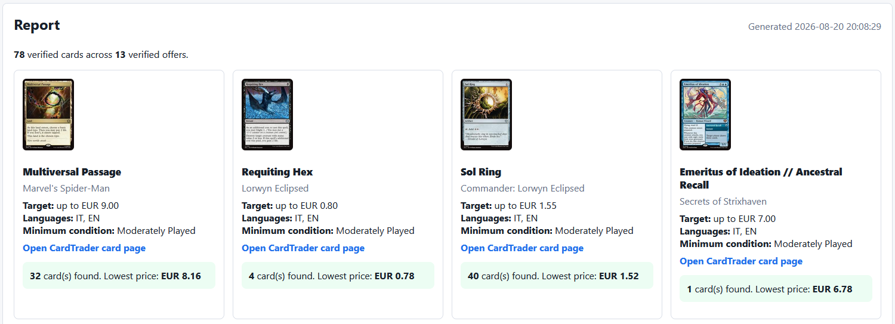
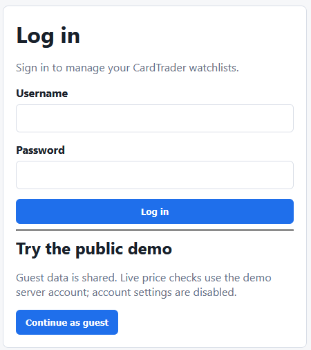
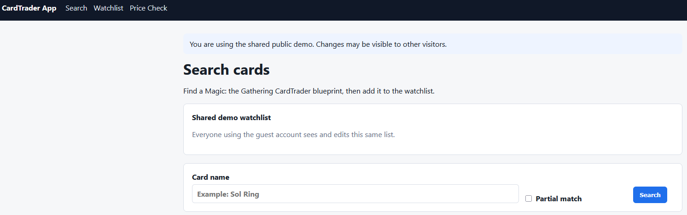
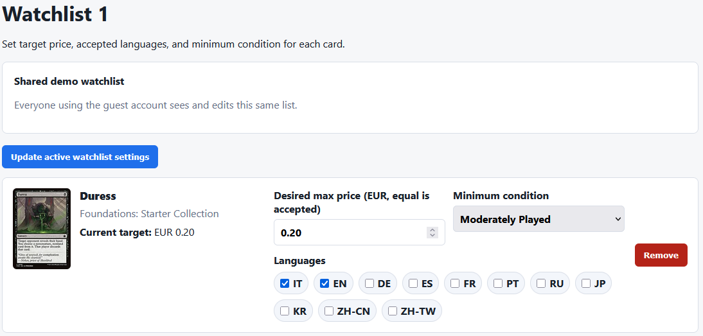
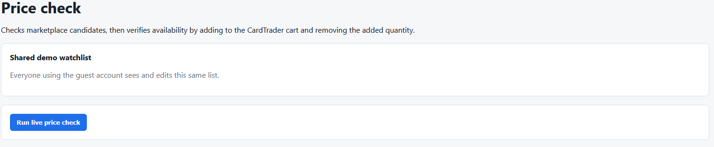
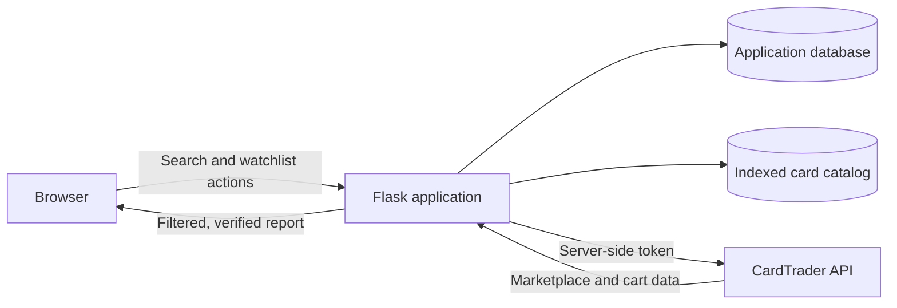

# CardTrader Watchlist

[](https://github.com/simonetanzi/cardtrader-app/actions/workflows/tests.yml)

### A production-minded Flask application for monitoring a curated selection of Magic: The Gathering cards across prices, conditions, and languages in one live check.

This project turns a repetitive marketplace workflow into a focused web product. Users build watchlists, define acceptable price, language, and condition criteria, and run live availability checks against CardTrader. A passwordless guest mode makes the complete workflow accessible to portfolio reviewers without exposing credentials or requiring account creation.

## Try the live application

### [Open the CardTrader Watchlist demo](https://cardtrader-app.onrender.com)

Select **Continue as guest** to explore the complete workflow without creating an account or providing an API key.

> **Hosting note:** if the application has not been used during the last 15 minutes, Render may need approximately one minute to activate the service. If the first request appears to be loading, please leave the page open while the application starts.



*One live check consolidates the complete watchlist and places cards with qualifying offers first.*

## Why I built it

Monitoring a personal selection of cards manually means repeating the same process over and over: search for each card, apply its price and condition requirements, check the acceptable languages, and review every result separately. That becomes slow and difficult to scan as the list grows.

I built this application to turn that repeated work into a single action. Each card keeps its own purchasing criteria, and one live check searches the entire watchlist and presents the results together on one page.

The application:

- Maintains a self-curated selection of cards to monitor.
- Stores individual price, language, and minimum-condition criteria for every card.
- Searches the live marketplace for the entire watchlist with one price-check action.
- Filters out offers that do not match the saved criteria.
- Consolidates every result into one report instead of requiring separate searches.
- Places cards with positive matches at the top, making useful results immediately visible.

The result is a fast monitoring tool: define what you are looking for once, then return whenever you want an up-to-date view of the whole selection.

## Engineering challenge: verifying real availability

The first version relied on CardTrader's public marketplace results. CardTrader documents that this endpoint is cached, so its reported price and quantity can occasionally differ from the live cart state. The results are useful for discovering candidate offers, but an offer returned by the API may already have been sold by the time a user runs a price check.

That created an important product problem: the application could satisfy every saved filter and still report a card that was no longer available.

I solved this by treating the marketplace response as a candidate list rather than the final source of truth. For each qualifying offer, the application:

1. Reads the current cart state.
2. Attempts to add the marketplace product to the CardTrader cart.
3. Compares the cart before and after the operation to confirm the quantity actually added.
4. Reports only the quantity verified through the cart.
5. After confirming the cart change, tracks the added quantity and removes it in a `finally` block, including when a later verification step fails.

If CardTrader rejects a stale offer, the application skips only that offer and continues checking the rest of the watchlist. A single outdated result therefore does not invalidate the complete run.

This approach combines the efficient, cacheable marketplace search with a live transactional availability check. The result page reflects cards that passed both the user's criteria and the cart verification at the time of the request—without exposing a purchase operation to the application.

## Engineering highlights

| Area | Implementation |
| --- | --- |
| Backend | Flask application factory, SQLAlchemy models, Flask-Login sessions, server-rendered Jinja templates |
| Data | Indexed SQLite catalog for fast card search; PostgreSQL-ready application persistence |
| External API | Narrow CardTrader client with an explicit endpoint allowlist, timeouts, structured errors, and rolling-window rate limits |
| Security | Server-only guest API token, CSRF protection, secure cookie settings, password hashing, ownership checks, and safe redirects |
| Public demo | Passwordless guest role with shared state and server-enforced restrictions on credentials and watchlist administration |
| Reliability | Cart cleanup in `finally`, bounded retry handling for HTTP 429 responses, stale-offer isolation, and automated tests |
| Deployment | Gunicorn process configuration and environment-driven settings for Render-compatible hosting |

## How to use the demo

The guest account exposes the real product workflow through one communal watchlist. Visitors can search, change card criteria, and run live checks, while credentials and watchlist-administration controls remain restricted.

<details>
<summary><strong>Open the five-step visual walkthrough</strong></summary>

### 1. Enter through the guest account

[Open the live application](https://cardtrader-app.onrender.com), then select **Continue as guest**. Everyone using the guest account sees and edits the same demonstration watchlist.



### 2. Find cards to monitor

Use **Search** to look up a card by name. Enable **Partial match** for broader results, then add the relevant printing to the watchlist.



### 3. Define the criteria for each card

Open **Watchlist** and configure each entry independently:

- **Desired max price** sets the highest acceptable price in euros.
- **Minimum condition** rejects cards below the selected quality.
- **Languages** limits results to the editions you are willing to purchase.

Select **Update active watchlist settings** to save the changes.



### 4. Run one live check

Open **Price Check** and select **Run live price check**. The server searches every configured card, applies its individual criteria, and verifies the candidate offers.



### 5. Review the consolidated report

Cards with qualifying offers appear first. Each result shows the verified quantity, lowest qualifying price, saved criteria, and a link to the corresponding CardTrader page.

</details>

## Architecture



The guest demonstration token remains in the hosting environment. It is never embedded in the repository or delivered to guest browsers. Private users can optionally configure their own account token. The API client permits marketplace and cart operations only; there is no purchase endpoint in the application.

## Guest and private accounts

| Capability | Guest | Private user |
| --- | :---: | :---: |
| Search the card catalog | Yes | Yes |
| Add, remove, and configure cards | Yes, shared | Yes, private |
| Run live price checks | Yes | Yes |
| Create and manage multiple watchlists | No | Yes |
| Configure a personal API token | No | Yes |
| Change account credentials | No | Yes |

The guest API token belongs to a dedicated, payment-free demonstration account. Guest restrictions are checked by Flask routes as well as reflected in the interface.

## Testing

The repository includes a GitHub Actions workflow that tests every push to `main` and every pull request targeting `main` in a clean Linux environment. The automated suite covers account isolation, guest permissions, token selection, endpoint restrictions, marketplace filtering, the cart-verification lifecycle, stale offers, error sanitization, retries, and rate limiting. The badge at the top of this page links to the latest published run.

Run the same suite locally with:

```powershell
pytest
```

## Technology

- Python
- Flask and Jinja
- Flask-Login
- SQLAlchemy
- SQLite and PostgreSQL
- Requests
- Gunicorn
- Pytest
- Render-compatible deployment

<details>
<summary><strong>Run locally</strong></summary>

### 1. Create the environment

```powershell
git clone https://github.com/simonetanzi/cardtrader-app.git
cd cardtrader-app
python -m venv .venv
.\.venv\Scripts\Activate.ps1
pip install -r requirements.txt
```

### 2. Configure environment variables

```powershell
$env:SECRET_KEY="replace-with-a-long-random-secret"
$env:CARDTRADER_API_TOKEN="replace-with-a-dedicated-cardtrader-token"
$env:ADMIN_USERNAME="admin"
$env:ADMIN_PASSWORD="replace-with-a-strong-password"
$env:ENABLE_GUEST_ACCOUNT="true"
$env:GUEST_USERNAME="guest"
```

Optional variables include `DATABASE_URL`, `USER_USERNAME`, `USER_PASSWORD`, and `SESSION_COOKIE_SECURE`.

### 3. Initialize and run

```powershell
flask --app app init-db
flask --app app run --host 127.0.0.1 --port 5000
```

Open `http://127.0.0.1:5000`.

</details>

<details>
<summary><strong>Deployment configuration</strong></summary>

Build command:

```text
pip install -r requirements.txt
```

Start command:

```text
gunicorn app:app
```

Production environment variables:

- `SECRET_KEY`
- `CARDTRADER_API_TOKEN`
- `DATABASE_URL`
- `ADMIN_USERNAME` and `ADMIN_PASSWORD`
- `ENABLE_GUEST_ACCOUNT=true`
- `GUEST_USERNAME=guest`
- `SESSION_COOKIE_SECURE=true`

Use managed PostgreSQL for persistent hosted data. The local SQLite application database is intended for development only.

</details>

## Current scope

The bundled catalog is limited to Magic: The Gathering. The project deliberately focuses on reliable search, watchlist management, and verified availability rather than purchasing or checkout automation.
